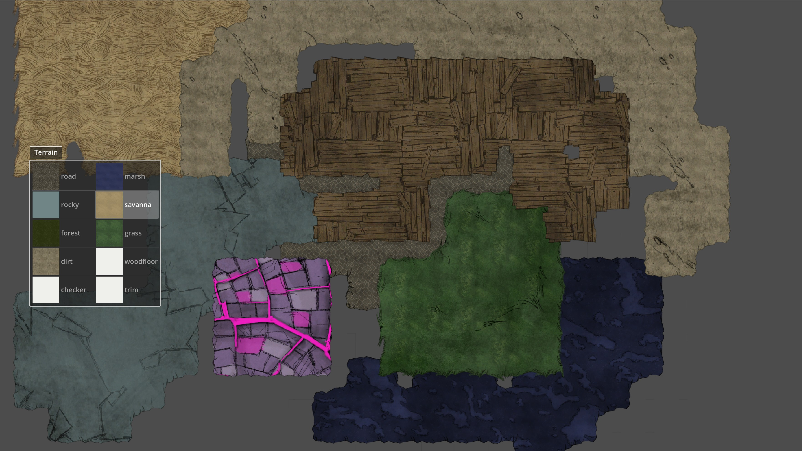

 # Don't Starve TileMap Toolkit

<div align="center">

[简体中文](README.md) | [English](doc/README_en.md)

</div>

一款用于《饥荒》地图开发的2D/3D实时编辑工具，基于Godot引擎构建的学习实践项目。

## 功能亮点

- 2D平面编辑模式（支持mipmap）
- 3D场景编辑（带分块加载系统）
- 做了一些速度优化

## 预览演示

| 2D编辑器 | 3D编辑器 |
|----------|----------|
|  |  |

## 快速开始

### 前置条件
- 《Don't Starve》游戏本体
- [KLei TexTool](https://github.com/handsomematt/dont-starve-tools.git)
- Python 3.8+
- Godot Engine 4.3+

### 安装步骤
1. 克隆仓库：
   ```bash
   git clone --recursive https://github.com/Zerovate/KLTilemap.git
   cd KLTilemap
   ```
2. 资源转换(待整理):
    ```bash
    cd .\assets\environment\tilemap\tool
    python convertor.py dont_starve_assets_path
    ```
3. 编译插件:
    ```bash
    cd .\extensions\KLTileMap
    build.cmd
    ```

## TODO
 - [ ] 3D 支持 mipmap (待迁移)
 - [ ] 3D 相机 zoom （待迁移）
 - [ ] 随机地图生成 (大概采用 vironoi or poission + random noise)
