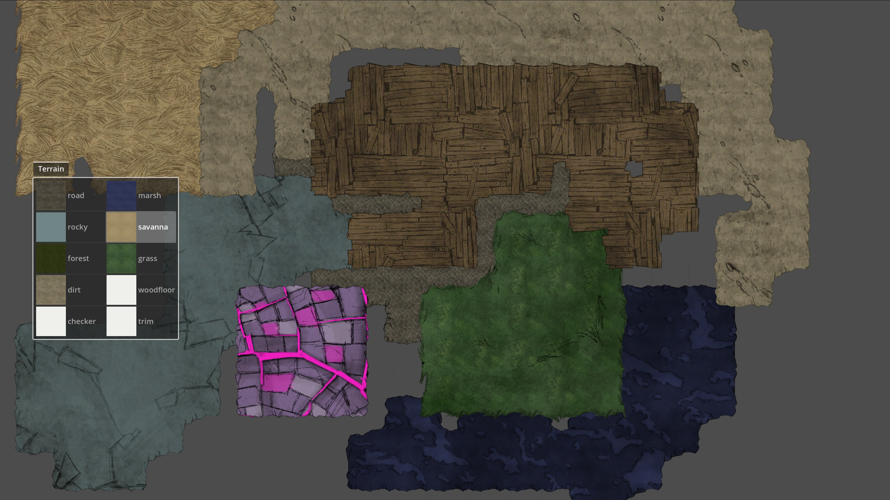
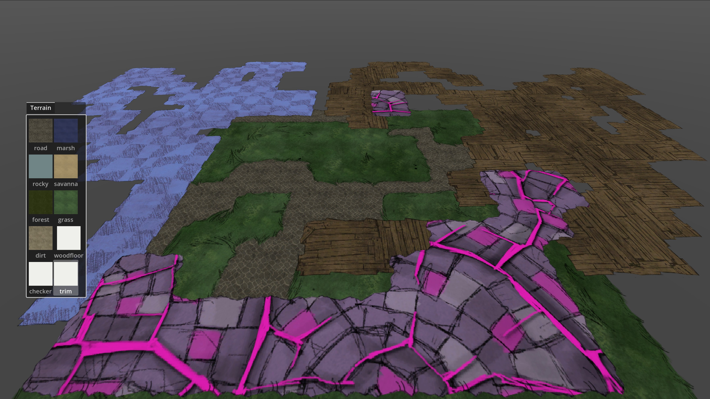

# Don't Starve TileMap Toolkit

<div align="center">

[简体中文](../README.md) | [English](README_en.md)

</div>

A real-time 2D/3D editing tool for Don't Starve map development, built with Godot Engine for educational purposes.

## Key Features

- 2D Plane Editing (mipmap supported)
- 3D Scene Editing (with chunk loading system)
- Production-ready optimizations

## Preview

| 2D Editor | 3D Editor |
|-----------|-----------|
|  |  |

## Quick Start

### Prerequisites
- Don't Starve game files
- [KLei TexTool](https://github.com/handsomematt/dont-starve-tools.git)
- Python 3.8+
- Godot Engine 4.3+

### Installation
1. Clone repository:
   ```bash
   git clone --recursive https://github.com/Zerovate/KLTilemap.git
   cd KLTilemap
   ```
2. Convert resources (TBD):
    ```bash
    cd .\assets\environment\tilemap\tool
    python convertor.py dont_starve_assets_path
    ```
3. Build extension:
    ```bash
    cd .\extensions\KLTileMap
    build.cmd
    ```

## TODO
 - [ ] 3D Mipmap Support (pending migration)
 - [ ] 3D Camera Zoom (to be migrated)
 - [ ] Random Map Generation (Voronoi/Poisson + Noise approach)

